# Solution Architecture — Twilio ↔ Azure Voice Live Outbound Voice Agent

This document shows the complete solution architecture with every component,
connection, and numbered flow step. Arrows use three styles:

- **Solid arrows (→)** — HTTP / REST calls
- **Thick arrows (⇒)** — Persistent WebSocket connections
- **Dashed arrows (⇢)** — Event/notification channels

---

## Architecture Diagram

```mermaid
graph LR
    classDef userZone fill:#E3F2FD,stroke:#1565C0,stroke-width:2px,color:#0D47A1
    classDef localZone fill:#FFF3E0,stroke:#E65100,stroke-width:2px,color:#BF360C
    classDef tunnelZone fill:#F3E5F5,stroke:#6A1B9A,stroke-width:2px,color:#4A148C
    classDef twilioZone fill:#E8F5E9,stroke:#2E7D32,stroke-width:2px,color:#1B5E20
    classDef phoneZone fill:#FBE9E7,stroke:#BF360C,stroke-width:2px,color:#BF360C
    classDef azureZone fill:#EDE7F6,stroke:#4527A0,stroke-width:2px,color:#311B92

    subgraph USER ["👤 User / Browser"]
        direction TB
        UI["🌐 React UI\n(localhost:3000)"]
        VITE["⚡ Vite Dev Server\nProxy :3000 → :8000"]
    end

    subgraph LOCAL ["🖥️ Local Machine"]
        direction TB
        FASTAPI["🐍 FastAPI + Uvicorn\n(localhost:8000)\n─────────────\nREST Endpoints:\n• POST /api/call\n• POST /twilio/twiml\n• POST /twilio/status\n─────────────\nWebSocket Endpoints:\n• WS /ws/media/call_id\n• WS /ws/events/call_id"]
        BRIDGE["🔀 MediaBridge\n(per-call instance)\n─────────────\nAudio Conversion:\nmulaw 8kHz ↔ PCM16 24kHz\n─────────────\nManages:\n• Twilio WS lifecycle\n• Azure WS lifecycle\n• Transcript forwarding"]
    end

    subgraph TUNNEL ["🔗 ngrok Tunnel"]
        NGROK["ngrok\nhttps://xxxx.ngrok-free.app\n→ localhost:8000\n─────────────\nForwards:\n• HTTPS callbacks\n• WSS connections"]
    end

    subgraph TWILIO ["☁️ Twilio Cloud"]
        direction TB
        TREST["📞 Twilio REST API\nPOST /Calls.json\n─────────────\nPlaces outbound\nPSTN calls"]
        TMEDIA["📡 Twilio Media Streams\n─────────────\nBidirectional audio\nmulaw 8kHz, base64\nover WebSocket"]
    end

    subgraph PHONE ["📱 PSTN"]
        CALLEE["📱 Callee's Phone\n─────────────\nReceives call\nSpeaks / Listens"]
    end

    subgraph AZURE ["☁️ Azure Cloud"]
        direction TB
        ENTRA["🔐 Microsoft Entra ID\n─────────────\nDefaultAzureCredential\nScope: ai.azure.com"]
        VOICELIVE["🤖 Azure Voice Live API\nwss://...cognitiveservices\n.azure.com\n/voice-live/realtime\n─────────────\n• GPT-4o Realtime\n• Server VAD\n• Whisper Transcription\n• TTS (Neural Voice)\n• Noise Suppression\n• Echo Cancellation"]
    end

    %% ── Call Initiation (Steps 1-5) ──
    UI -->|"① POST /api/call\n{phone, backend}"| VITE
    VITE -->|"② Proxy to :8000"| FASTAPI
    FASTAPI -->|"③ POST /Calls.json\n{From, To, Url, StatusCallback}"| TREST
    TREST -->|"④ 201 Created\n{CallSid}"| FASTAPI
    FASTAPI -->|"⑤ {call_id, sid}"| UI

    %% ── Frontend Event Subscription (Step 6) ──
    UI -.->|"⑥ WS /ws/events/call_id\n(subscribe transcripts)"| FASTAPI

    %% ── PSTN Call (Steps 7-8) ──
    TREST -->|"⑦ Outbound\nPSTN Ring"| CALLEE
    CALLEE -->|"⑧ Answers"| TREST

    %% ── TwiML Webhook via ngrok (Steps 9-13) ──
    TREST -->|"⑨ POST /twilio/twiml\n(via ngrok)"| NGROK
    NGROK -->|"⑩ Forward"| FASTAPI
    FASTAPI -->|"⑪ TwiML XML\n‹Say› + ‹Stream›"| NGROK
    NGROK -->|"⑫ Return TwiML"| TREST
    TREST -->|"⑬ Play greeting"| CALLEE

    %% ── Media WS + Azure Connection (Steps 14-19) ──
    TMEDIA ==>|"⑭ WSS /ws/media/call_id\n(via ngrok)"| NGROK
    NGROK ==>|"⑮ Forward WS"| FASTAPI
    FASTAPI -->|"⑯ Delegate to"| BRIDGE
    BRIDGE -->|"⑰ get_token()"| ENTRA
    ENTRA -->|"⑱ Bearer token"| BRIDGE
    BRIDGE ==>|"⑲ WSS connect +\nsession.update"| VOICELIVE

    %% ── Bidirectional Audio Streaming (Steps 20-27) ──
    CALLEE -->|"⑳ Voice (analog)"| TMEDIA
    TMEDIA -->|"㉑ media event\nmulaw 8kHz base64"| NGROK
    NGROK -->|"㉒"| BRIDGE
    BRIDGE -->|"㉓ PCM16 24kHz\ninput_audio_buffer\n.append"| VOICELIVE
    VOICELIVE -->|"㉔ response.audio\n.delta PCM16 24kHz"| BRIDGE
    BRIDGE -->|"㉕ mulaw 8kHz\nmedia event"| NGROK
    NGROK -->|"㉖"| TMEDIA
    TMEDIA -->|"㉗ Play AI speech"| CALLEE

    %% ── Live Transcripts (Steps 28-30) ──
    VOICELIVE -.->|"㉘ Transcripts"| BRIDGE
    BRIDGE -.->|"㉙ {role, text}"| FASTAPI
    FASTAPI -.->|"㉚ WS event"| UI

    class UI,VITE userZone
    class FASTAPI,BRIDGE localZone
    class NGROK tunnelZone
    class TREST,TMEDIA twilioZone
    class CALLEE phoneZone
    class ENTRA,VOICELIVE azureZone
```

---

## Legend — Step-by-Step Flow

### Call Initiation (Steps ①–⑤)

| Step | From → To | Protocol | Description |
|------|-----------|----------|-------------|
| **①** | React UI → Vite | HTTP POST | User enters phone number (E.164) and selects AI backend (`gpt-realtime` or `voice-live`). Clicks **Place Call**. Frontend sends `POST /api/call {phone_number, backend}`. |
| **②** | Vite → FastAPI | HTTP POST | Vite dev server proxies the request from `:3000` to `localhost:8000`. In production this proxy is replaced by direct access to the backend URL. |
| **③** | FastAPI → Twilio REST API | HTTPS POST | Backend generates a unique `call_id`, creates a `MediaBridge` instance, and calls Twilio's `POST /2010-04-01/Accounts/{SID}/Calls.json` with: `From` (Twilio number), `To` (callee), `Url` (ngrok + `/twilio/twiml?call_id=X`), and `StatusCallback` (ngrok + `/twilio/status`). |
| **④** | Twilio REST API → FastAPI | HTTPS Response | Twilio responds `201 Created` with the `CallSid`. Backend stores it in `call_metadata`. |
| **⑤** | FastAPI → React UI | HTTP Response | Backend returns `{call_id, twilio_sid, status: "queued"}` to the frontend. UI updates to show "Calling..." state. |

### Frontend Event Subscription (Step ⑥)

| Step | From → To | Protocol | Description |
|------|-----------|----------|-------------|
| **⑥** | React UI → FastAPI | WebSocket | Frontend opens a persistent WS connection to `/ws/events/{call_id}` (proxied via Vite). This channel will receive live transcripts and call status updates throughout the call. |

### PSTN Call (Steps ⑦–⑧)

| Step | From → To | Protocol | Description |
|------|-----------|----------|-------------|
| **⑦** | Twilio → Callee Phone | PSTN (SIP → SS7) | Twilio's telephony infrastructure places the outbound call. The callee's phone rings. |
| **⑧** | Callee Phone → Twilio | PSTN | Callee answers the phone. Twilio detects the answer and needs instructions on what to do next — it fetches the TwiML URL provided in step ③. |

### TwiML Webhook via ngrok (Steps ⑨–⑬)

| Step | From → To | Protocol | Description |
|------|-----------|----------|-------------|
| **⑨** | Twilio → ngrok | HTTPS POST | Twilio sends `POST https://xxxx.ngrok-free.app/twilio/twiml?call_id=X` to fetch call instructions. This is the critical step where ngrok bridges Twilio (internet) to your local machine. |
| **⑩** | ngrok → FastAPI | HTTP POST | ngrok tunnels the request to `localhost:8000/twilio/twiml`. |
| **⑪** | FastAPI → ngrok | HTTP Response | Backend constructs TwiML XML containing: `<Say>Please wait while we connect you to our AI assistant.</Say>` followed by `<Connect><Stream url="wss://xxxx.ngrok-free.app/ws/media/{call_id}"/></Connect>`. The `<Stream>` URL tells Twilio where to open a media WebSocket. |
| **⑫** | ngrok → Twilio | HTTPS Response | TwiML XML returned to Twilio. |
| **⑬** | Twilio → Callee Phone | PSTN Audio | Twilio's text-to-speech engine plays _"Please wait while we connect you to our AI assistant"_ to the callee's phone speaker. |

### Media WebSocket + Azure Connection (Steps ⑭–⑲)

| Step | From → To | Protocol | Description |
|------|-----------|----------|-------------|
| **⑭** | Twilio Media Streams → ngrok | WSS | After processing the TwiML `<Stream>` directive, Twilio opens a **persistent WebSocket** to `wss://xxxx.ngrok-free.app/ws/media/{call_id}`. This is the bidirectional audio channel. |
| **⑮** | ngrok → FastAPI | WebSocket | ngrok tunnels the WebSocket upgrade to `localhost:8000`. FastAPI accepts it at the `/ws/media/{call_id}` endpoint. |
| **⑯** | FastAPI → MediaBridge | Internal | FastAPI looks up the `MediaBridge` instance (created in step ③) from `active_sessions[call_id]` and calls `bridge.handle_twilio_stream(websocket)`. The bridge now owns the Twilio WS connection. |
| **⑰** | MediaBridge → Entra ID | HTTPS | Bridge creates an `AzureVoiceLiveSession` which calls `DefaultAzureCredential().get_token("https://ai.azure.com/.default")`. Locally this uses your `az login` session; in production it uses managed identity. |
| **⑱** | Entra ID → MediaBridge | HTTPS Response | Entra returns a Bearer access token valid for the Azure Voice Live API. |
| **⑲** | MediaBridge → Azure Voice Live | WSS | Bridge opens a **persistent WebSocket** to `wss://{endpoint}/voice-live/realtime?api-version=2025-05-01-preview&model=gpt-4o-realtime-preview` with the Bearer token. Once connected, it sends a `session.update` message configuring: modalities (text + audio), input/output format (PCM16 24kHz), server VAD, Whisper transcription, noise suppression, echo cancellation, and the TTS voice. |

### Bidirectional Audio Streaming (Steps ⑳–㉗)

_These steps repeat continuously (~50 times/second) for the duration of the call._

| Step | From → To | Protocol | Data Format | Description |
|------|-----------|----------|-------------|-------------|
| **⑳** | Callee Phone → Twilio Media Streams | PSTN → Digital | Analog → mulaw 8kHz | Callee speaks into their phone. The analog voice signal is digitized by the phone network into **G.711 μ-law** at **8,000 Hz** (64 kbps). |
| **㉑** | Twilio Media Streams → ngrok | WSS (JSON) | `{event: "media", media: {payload: "<base64 mulaw>"}}` | Twilio sends audio chunks (~20ms each, ~160 bytes of mulaw) as base64-encoded JSON messages over the media WebSocket. |
| **㉒** | ngrok → MediaBridge | WSS | Same JSON | ngrok forwards the WebSocket frame. MediaBridge's `_process_twilio_message()` handles it. |
| **㉓** | MediaBridge → Azure Voice Live | WSS (JSON) | `{type: "input_audio_buffer.append", audio: "<base64 PCM16 24kHz>"}` | **Audio conversion happens here:** `base64.decode → audioop.ulaw2lin (mulaw→PCM16) → audioop.ratecv (8kHz→24kHz) → base64.encode`. The converted PCM16 24kHz audio is sent to Azure. |
| **㉔** | Azure Voice Live → MediaBridge | WSS (JSON) | `{type: "response.audio.delta", delta: "<base64 PCM16 24kHz>"}` | Azure's GPT-4o model generates a speech response. Server VAD detects when the user stops speaking, then the model produces PCM16 24kHz audio chunks streamed back in real time. |
| **㉕** | MediaBridge → ngrok | WSS (JSON) | `{event: "media", streamSid: "...", media: {payload: "<base64 mulaw 8kHz>"}}` | **Reverse audio conversion:** `base64.decode → audioop.ratecv (24kHz→8kHz) → audioop.lin2ulaw (PCM16→mulaw) → base64.encode`. Sent as a Twilio media event. |
| **㉖** | ngrok → Twilio Media Streams | WSS | Same JSON | ngrok forwards the response frame back to Twilio. |
| **㉗** | Twilio Media Streams → Callee Phone | Digital → PSTN | mulaw 8kHz → Analog | Twilio plays the AI-generated audio through the phone speaker. The callee hears the AI voice. |

### Live Transcripts to Frontend (Steps ㉘–㉚)

| Step | From → To | Protocol | Description |
|------|-----------|----------|-------------|
| **㉘** | Azure Voice Live → MediaBridge | WSS | Azure sends transcript events: `conversation.item.input_audio_transcription.completed` (what the user said) and `response.audio_transcript.done` (what the AI said). These come from Whisper running server-side. |
| **㉙** | MediaBridge → FastAPI | Internal callback | Bridge's `_handle_transcript(role, text)` is called. FastAPI's `_broadcast_event()` serializes it as `{type: "transcript", role: "user"|"assistant", text: "..."}`. |
| **㉚** | FastAPI → React UI | WebSocket | The transcript event is pushed to all subscribers on `/ws/events/{call_id}`. The React UI renders it in the chat-style transcript view in real time. |

---

## Component Summary

| Component | Technology | Location | Role |
|-----------|-----------|----------|------|
| **React UI** | React 19 + JSX | `localhost:3000` | Phone number input, call controls, live transcript display |
| **Vite Dev Server** | Vite 5 | `:3000` → `:8000` proxy | Proxies `/api/*` and `/ws/*` to FastAPI (dev only) |
| **FastAPI + Uvicorn** | Python 3.11+ / FastAPI | `localhost:8000` | REST endpoints, WebSocket handlers, call orchestration |
| **MediaBridge** | Python (in-process) | Per-call instance | Audio format conversion (audioop), Azure/Twilio WS lifecycle |
| **ngrok** | ngrok CLI | `xxxx.ngrok-free.app` → `:8000` | Tunnels Twilio callbacks/WS to local machine (dev only) |
| **Twilio REST API** | Twilio Cloud | `api.twilio.com` | Places outbound PSTN calls |
| **Twilio Media Streams** | Twilio Cloud | WebSocket | Streams bidirectional mulaw 8kHz audio |
| **Callee Phone** | PSTN | Mobile/Landline | The human on the other end |
| **Microsoft Entra ID** | Azure AD | `login.microsoftonline.com` | Issues Bearer tokens for Azure API auth |
| **Azure Voice Live API** | Azure AI Services | `wss://...cognitiveservices.azure.com` | GPT-4o Realtime: VAD, Whisper, speech generation, TTS |

## Connection Types

| Arrow Style | Meaning | Examples |
|-------------|---------|----------|
| **Solid (→)** | HTTP request/response or one-shot call | REST API calls, TwiML webhook, token request |
| **Thick (⇒)** | Persistent WebSocket (long-lived) | Twilio media stream, Azure Voice Live session |
| **Dashed (⇢)** | Event/notification channel | Frontend transcript WS, transcript callbacks |

## Color Legend

| Color | Zone | Components |
|-------|------|------------|
| 🔵 Blue | User / Browser | React UI, Vite Dev Server |
| 🟠 Orange | Local Machine | FastAPI + Uvicorn, MediaBridge |
| 🟣 Purple | Tunnel | ngrok |
| 🟢 Green | Twilio Cloud | Twilio REST API, Twilio Media Streams |
| 🔴 Red/Peach | PSTN | Callee's Phone |
| 🟣 Indigo | Azure Cloud | Microsoft Entra ID, Azure Voice Live API |
