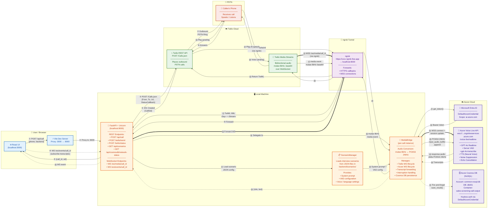

# Solution Architecture — Twilio ↔ Azure Voice Live Outbound Voice Agent

This document shows the complete solution architecture with every component,
connection, and numbered flow step. It covers both the **development setup**
(ngrok tunnel on your local machine) and the **production deployment** (Azure
Container Apps with direct public endpoint).

Arrows use three styles:

- **Solid arrows (→)** — HTTP / REST calls
- **Thick arrows (⇒)** — Persistent WebSocket connections
- **Dashed arrows (⇢)** — Event/notification channels

---

## Development Architecture Diagram

> This diagram shows the local development setup where ngrok tunnels Twilio's
> traffic to `localhost:8000`. See [NGROK_TUNNEL.md](NGROK_TUNNEL.md) for a
> protocol-level explanation of how ngrok tunneling works.


```mermaid
graph LR
    classDef userZone fill:#E3F2FD,stroke:#1565C0,stroke-width:2px,color:#0D47A1
    classDef localZone fill:#FFF3E0,stroke:#E65100,stroke-width:2px,color:#BF360C
    classDef tunnelZone fill:#F3E5F5,stroke:#6A1B9A,stroke-width:2px,color:#4A148C
    classDef twilioZone fill:#E8F5E9,stroke:#2E7D32,stroke-width:2px,color:#1B5E20
    classDef phoneZone fill:#FBE9E7,stroke:#BF360C,stroke-width:2px,color:#BF360C
    classDef azureZone fill:#EDE7F6,stroke:#4527A0,stroke-width:2px,color:#311B92

    subgraph USER ["👤 User / Browser"]
        direction TB
        UI["🌐 React UI\n(localhost:3000)"]
        VITE["⚡ Vite Dev Server\nProxy :3000 → :8000"]
    end

    subgraph LOCAL ["🖥️ Local Machine"]
        direction TB
        FASTAPI["🐍 FastAPI + Uvicorn\n(localhost:8000)\n─────────────\nREST Endpoints:\n• POST /api/call\n• POST /twilio/twiml\n• POST /twilio/status\n• GET /api/scenarios\n• GET /api/cosmosdb/network-status\n─────────────\nWebSocket Endpoints:\n• WS /ws/media/call_id\n• WS /ws/events/call_id"]
        BRIDGE["🔀 MediaBridge\n(per-call instance)\n─────────────\nAudio Conversion:\nmulaw 8kHz ↔ PCM16 24kHz\n─────────────\nManages:\n• Twilio WS lifecycle\n• Azure WS lifecycle\n• Transcript forwarding\n• Interruption handling\n• Cosmos DB persistence"]
        SCENARIO["📋 ScenarioManager\n─────────────\nLoads interview scenarios\nfrom JSON files in\nbackend/scenarios/\n─────────────\nProvides:\n• System prompt\n• VAD configuration\n• Voice / language settings"]
    end

    subgraph TUNNEL ["🔗 ngrok Tunnel"]
        NGROK["ngrok\nhttps://xxxx.ngrok-free.app\n→ localhost:8000\n─────────────\nForwards:\n• HTTPS callbacks\n• WSS connections"]
    end

    subgraph TWILIO ["☁️ Twilio Cloud"]
        direction TB
        TREST["📞 Twilio REST API\nPOST /Calls.json\n─────────────\nPlaces outbound\nPSTN calls"]
        TMEDIA["📡 Twilio Media Streams\n─────────────\nBidirectional audio\nmulaw 8kHz, base64\nover WebSocket"]
    end

    subgraph PHONE ["📱 PSTN"]
        CALLEE["📱 Callee's Phone\n─────────────\nReceives call\nSpeaks / Listens"]
    end

    subgraph AZURE ["☁️ Azure Cloud"]
        direction TB
        ENTRA["🔐 Microsoft Entra ID\n─────────────\nDefaultAzureCredential\nScope: ai.azure.com"]
        VOICELIVE["🤖 Azure Voice Live API\nwss://...cognitiveservices\n.azure.com\n/voice-live/realtime\n─────────────\n• GPT-4o Realtime\n• Server VAD\n• gpt-4o-transcribe\n• TTS (Neural Voice)\n• Noise Suppression\n• Echo Cancellation"]
        COSMOSDB["🗄️ Azure Cosmos DB\n(NoSQL)\n─────────────\nAccount: common-nosql-db\nDB: db001\nContainer:\nsales-screening-oall-output\n─────────────\nKeyless auth via\nDefaultAzureCredential"]
    end

    %% ── Call Initiation (Steps 1-5) ──
    UI -->|"① POST /api/call\n{phone, backend}"| VITE
    VITE -->|"② Proxy to :8000"| FASTAPI
    FASTAPI -->|"③ POST /Calls.json\n{From, To, Url, StatusCallback}"| TREST
    TREST -->|"④ 201 Created\n{CallSid}"| FASTAPI
    FASTAPI -->|"⑤ {call_id, sid}"| UI

    %% ── Frontend Event Subscription (Step 6) ──
    UI -.->|"⑥ WS /ws/events/call_id\n(subscribe transcripts)"| FASTAPI

    %% ── PSTN Call (Steps 7-8) ──
    TREST -->|"⑦ Outbound\nPSTN Ring"| CALLEE
    CALLEE -->|"⑧ Answers"| TREST

    %% ── TwiML Webhook via ngrok (Steps 9-13) ──
    TREST -->|"⑨ POST /twilio/twiml\n(via ngrok)"| NGROK
    NGROK -->|"⑩ Forward"| FASTAPI
    FASTAPI -->|"⑪ TwiML XML\n‹Say› + ‹Stream›"| NGROK
    NGROK -->|"⑫ Return TwiML"| TREST
    TREST -->|"⑬ Play greeting"| CALLEE

    %% ── Media WS + Azure Connection (Steps 14-19) ──
    TMEDIA ==>|"⑭ WSS /ws/media/call_id\n(via ngrok)"| NGROK
    NGROK ==>|"⑮ Forward WS"| FASTAPI
    FASTAPI -->|"⑯ Delegate to"| BRIDGE
    BRIDGE -->|"⑰ get_token()"| ENTRA
    ENTRA -->|"⑱ Bearer token"| BRIDGE
    BRIDGE ==>|"⑲ WSS connect +\nsession.update"| VOICELIVE

    %% ── Bidirectional Audio Streaming (Steps 20-27) ──
    CALLEE -->|"⑳ Voice (analog)"| TMEDIA
    TMEDIA -->|"㉑ media event\nmulaw 8kHz base64"| NGROK
    NGROK -->|"㉒"| BRIDGE
    BRIDGE -->|"㉓ PCM16 24kHz\ninput_audio_buffer\n.append"| VOICELIVE
    VOICELIVE -->|"㉔ response.audio\n.delta PCM16 24kHz"| BRIDGE
    BRIDGE -->|"㉕ mulaw 8kHz\nmedia event"| NGROK
    NGROK -->|"㉖"| TMEDIA
    TMEDIA -->|"㉗ Play AI speech"| CALLEE

    %% ── Live Transcripts (Steps 28-30) ──
    VOICELIVE -.->|"㉘ Transcripts"| BRIDGE
    BRIDGE -.->|"㉙ {role, text}"| FASTAPI
    FASTAPI -.->|"㉚ WS event"| UI

    %% ── Scenario Loading (Step 31) ──
    FASTAPI -->|"㉛ Load scenario\nJSON config"| SCENARIO
    SCENARIO -->|"㉜ System prompt +\nVAD config"| BRIDGE

    %% ── Cosmos DB Persistence (Step 33) ──
    BRIDGE -.->|"㉝ Fire-and-forget\nsave_result()"| COSMOSDB

    class UI,VITE userZone
    class FASTAPI,BRIDGE,SCENARIO localZone
    class NGROK tunnelZone
    class TREST,TMEDIA twilioZone
    class CALLEE phoneZone
    class ENTRA,VOICELIVE,COSMOSDB azureZone
```

---

## Legend — Step-by-Step Flow

### Call Initiation (Steps ①–⑤)

| Step | From → To | Protocol | Description |
|------|-----------|----------|-------------|
| **①** | React UI → Vite | HTTP POST | User enters phone number (E.164) and selects AI backend (`gpt-realtime` or `voice-live`). Clicks **Place Call**. Frontend sends `POST /api/call {phone_number, backend}`. |
| **②** | Vite → FastAPI | HTTP POST | Vite dev server proxies the request from `:3000` to `localhost:8000`. In production this proxy is replaced by direct access to the backend URL. |
| **③** | FastAPI → Twilio REST API | HTTPS POST | Backend generates a unique `call_id`, creates a `MediaBridge` instance, and calls Twilio's `POST /2010-04-01/Accounts/{SID}/Calls.json` with: `From` (Twilio number), `To` (callee), `Url` (ngrok + `/twilio/twiml?call_id=X`), and `StatusCallback` (ngrok + `/twilio/status`). |
| **④** | Twilio REST API → FastAPI | HTTPS Response | Twilio responds `201 Created` with the `CallSid`. Backend stores it in `call_metadata`. |
| **⑤** | FastAPI → React UI | HTTP Response | Backend returns `{call_id, twilio_sid, status: "queued"}` to the frontend. UI updates to show "Calling..." state. |

### Frontend Event Subscription (Step ⑥)

| Step | From → To | Protocol | Description |
|------|-----------|----------|-------------|
| **⑥** | React UI → FastAPI | WebSocket | Frontend opens a persistent WS connection to `/ws/events/{call_id}` (proxied via Vite). This channel will receive live transcripts and call status updates throughout the call. |

### PSTN Call (Steps ⑦–⑧)

| Step | From → To | Protocol | Description |
|------|-----------|----------|-------------|
| **⑦** | Twilio → Callee Phone | PSTN (SIP → SS7) | Twilio's telephony infrastructure places the outbound call. The callee's phone rings. |
| **⑧** | Callee Phone → Twilio | PSTN | Callee answers the phone. Twilio detects the answer and needs instructions on what to do next — it fetches the TwiML URL provided in step ③. |

### TwiML Webhook via ngrok (Steps ⑨–⑬)

| Step | From → To | Protocol | Description |
|------|-----------|----------|-------------|
| **⑨** | Twilio → ngrok | HTTPS POST | Twilio sends `POST https://xxxx.ngrok-free.app/twilio/twiml?call_id=X` to fetch call instructions. This is the critical step where ngrok bridges Twilio (internet) to your local machine. |
| **⑩** | ngrok → FastAPI | HTTP POST | ngrok tunnels the request to `localhost:8000/twilio/twiml`. |
| **⑪** | FastAPI → ngrok | HTTP Response | Backend constructs TwiML XML containing: `<Say>Please wait while we connect you to our AI assistant.</Say>` followed by `<Connect><Stream url="wss://xxxx.ngrok-free.app/ws/media/{call_id}"/></Connect>`. The `<Stream>` URL tells Twilio where to open a media WebSocket. |
| **⑫** | ngrok → Twilio | HTTPS Response | TwiML XML returned to Twilio. |
| **⑬** | Twilio → Callee Phone | PSTN Audio | Twilio's text-to-speech engine plays _"Please wait while we connect you to our AI assistant"_ to the callee's phone speaker. |

### Media WebSocket + Azure Connection (Steps ⑭–⑲)

| Step | From → To | Protocol | Description |
|------|-----------|----------|-------------|
| **⑭** | Twilio Media Streams → ngrok | WSS | After processing the TwiML `<Stream>` directive, Twilio opens a **persistent WebSocket** to `wss://xxxx.ngrok-free.app/ws/media/{call_id}`. This is the bidirectional audio channel. |
| **⑮** | ngrok → FastAPI | WebSocket | ngrok tunnels the WebSocket upgrade to `localhost:8000`. FastAPI accepts it at the `/ws/media/{call_id}` endpoint. |
| **⑯** | FastAPI → MediaBridge | Internal | FastAPI looks up the `MediaBridge` instance (created in step ③) from `active_sessions[call_id]` and calls `bridge.handle_twilio_stream(websocket)`. The bridge now owns the Twilio WS connection. |
| **⑰** | MediaBridge → Entra ID | HTTPS | Bridge creates an `AzureVoiceLiveSession` which calls `DefaultAzureCredential().get_token("https://ai.azure.com/.default")`. Locally this uses your `az login` session; in production it uses managed identity. |
| **⑱** | Entra ID → MediaBridge | HTTPS Response | Entra returns a Bearer access token valid for the Azure Voice Live API. |
| **⑲** | MediaBridge → Azure Voice Live | WSS | Bridge opens a **persistent WebSocket** to `wss://{endpoint}/voice-live/realtime?api-version=2025-05-01-preview&model=gpt-4o-realtime-preview` with the Bearer token. Once connected, it sends a `session.update` message configuring: modalities (text + audio), input/output format (PCM16 24kHz), server VAD, Whisper transcription, noise suppression, echo cancellation, and the TTS voice. |

### Bidirectional Audio Streaming (Steps ⑳–㉗)

_These steps repeat continuously (~50 times/second) for the duration of the call._

| Step | From → To | Protocol | Data Format | Description |
|------|-----------|----------|-------------|-------------|
| **⑳** | Callee Phone → Twilio Media Streams | PSTN → Digital | Analog → mulaw 8kHz | Callee speaks into their phone. The analog voice signal is digitized by the phone network into **G.711 μ-law** at **8,000 Hz** (64 kbps). |
| **㉑** | Twilio Media Streams → ngrok | WSS (JSON) | `{event: "media", media: {payload: "<base64 mulaw>"}}` | Twilio sends audio chunks (~20ms each, ~160 bytes of mulaw) as base64-encoded JSON messages over the media WebSocket. |
| **㉒** | ngrok → MediaBridge | WSS | Same JSON | ngrok forwards the WebSocket frame. MediaBridge's `_process_twilio_message()` handles it. |
| **㉓** | MediaBridge → Azure Voice Live | WSS (JSON) | `{type: "input_audio_buffer.append", audio: "<base64 PCM16 24kHz>"}` | **Audio conversion happens here:** `base64.decode → audioop.ulaw2lin (mulaw→PCM16) → audioop.ratecv (8kHz→24kHz) → base64.encode`. The converted PCM16 24kHz audio is sent to Azure. |
| **㉔** | Azure Voice Live → MediaBridge | WSS (JSON) | `{type: "response.audio.delta", delta: "<base64 PCM16 24kHz>"}` | Azure's GPT-4o model generates a speech response. Server VAD detects when the user stops speaking, then the model produces PCM16 24kHz audio chunks streamed back in real time. |
| **㉕** | MediaBridge → ngrok | WSS (JSON) | `{event: "media", streamSid: "...", media: {payload: "<base64 mulaw 8kHz>"}}` | **Reverse audio conversion:** `base64.decode → audioop.ratecv (24kHz→8kHz) → audioop.lin2ulaw (PCM16→mulaw) → base64.encode`. Sent as a Twilio media event. |
| **㉖** | ngrok → Twilio Media Streams | WSS | Same JSON | ngrok forwards the response frame back to Twilio. |
| **㉗** | Twilio Media Streams → Callee Phone | Digital → PSTN | mulaw 8kHz → Analog | Twilio plays the AI-generated audio through the phone speaker. The callee hears the AI voice. |

### Live Transcripts to Frontend (Steps ㉘–㉚)

| Step | From → To | Protocol | Description |
|------|-----------|----------|-------------|
| **㉘** | Azure Voice Live → MediaBridge | WSS | Azure sends transcript events: `conversation.item.input_audio_transcription.completed` (what the user said) and `response.audio_transcript.done` (what the AI said). These come from `gpt-4o-transcribe` running server-side. |
| **㉙** | MediaBridge → FastAPI | Internal callback | Bridge's `_handle_transcript(role, text)` is called. FastAPI's `_broadcast_event()` serializes it as `{type: "transcript", role: "user"\|"assistant", text: "..."}`. |
| **㉚** | FastAPI → React UI | WebSocket | The transcript event is pushed to all subscribers on `/ws/events/{call_id}`. The React UI renders it in the chat-style transcript view in real time. |

### Scenario Loading (Steps ㉛–㉜)

| Step | From → To | Protocol | Description |
|------|-----------|----------|-------------|
| **㉛** | FastAPI → ScenarioManager | Internal | When a call is initiated, the backend loads the selected interview scenario JSON from `backend/scenarios/`. The ScenarioManager parses the file and returns the system prompt, VAD configuration, voice/language settings, and interview structure. |
| **㉜** | ScenarioManager → MediaBridge | Internal | The parsed scenario config is passed to the MediaBridge, which uses it to configure the Azure `session.update` message (system instructions, VAD threshold, voice name, etc.). |

### Cosmos DB Persistence (Step ㉝)

| Step | From → To | Protocol | Description |
|------|-----------|----------|-------------|
| **㉝** | MediaBridge → Azure Cosmos DB | HTTPS | When the call ends, the MediaBridge fires a **fire-and-forget** `asyncio.ensure_future()` call to `cosmosdb_client.save_result()`. The interview transcript, scores, and metadata are upserted to the Cosmos DB NoSQL container. Uses `DefaultAzureCredential` (keyless auth). The call does not block on persistence — the response to Twilio is sent immediately. |

### Interruption Handling (Barge-in)

_This flow occurs whenever the callee speaks while the AI is still playing audio._

| Step | From → To | Description |
|------|-----------|-------------|
| **A** | Azure VAD → MediaBridge | Azure's server VAD detects `input_audio_buffer.speech_started`. |
| **B** | MediaBridge → Twilio | MediaBridge **always** sends a `clear` event to Twilio to flush its audio playback buffer, regardless of whether the AI response is still being generated. This is critical because Azure generates audio faster than real-time, so Twilio may have seconds of buffered audio even after Azure has finished. |
| **C** | MediaBridge → Azure | If the AI response is still being generated (`_response_in_progress == True`), MediaBridge sends `response.cancel` to Azure to stop generation and sets `_mute_audio = True` to discard any in-flight audio deltas. |
| **D** | Azure → MediaBridge | Azure sends `response.done` when cancellation completes. MediaBridge resets `_mute_audio = False`. |

---

## Twilio Services Used in This Solution

This solution depends on **six Twilio services** working together. Understanding
each one — and the direction of every connection — is critical to debugging and
scaling.

### 1. Twilio Programmable Voice — REST API

**What it is:** The HTTP API that our backend calls to place outbound PSTN calls.

**How we use it:** `twilio_client.py` sends `POST /2010-04-01/Accounts/{SID}/Calls.json`
with three key parameters:

| Parameter | Value | Purpose |
|-----------|-------|---------|
| `From` | Our Twilio phone number | Caller ID shown to the callee |
| `To` | Callee's phone number (E.164) | The number to dial |
| `Url` | `https://{PUBLIC_URL}/twilio/twiml?call_id=X` | TwiML webhook — Twilio fetches this when the callee answers |
| `StatusCallback` | `https://{PUBLIC_URL}/twilio/status` | Status webhook — Twilio POSTs call lifecycle events here |

**Connection direction:** Our backend → Twilio cloud (outbound HTTPS POST).

> 📖 [Twilio Calls REST API — Create a Call](https://www.twilio.com/docs/voice/api/call-resource#create-a-call-resource)

---

### 2. Twilio Super Network — PSTN Gateway

**What it is:** Twilio's global telephony infrastructure (the "Super Network")
that bridges the internet/VoIP world and the traditional PSTN phone network. It
handles:

- **Signaling conversion** — SIP on the Twilio side ↔ SS7/ISUP on the carrier
  side. Twilio's media servers negotiate with the callee's carrier to set up the
  voice circuit.
- **Codec negotiation** — Agrees on G.711 μ-law (or A-law in some regions) with
  the far-end carrier.
- **Digital ↔ analog conversion** — The last-mile conversion happens at the
  callee's carrier or handset. Twilio delivers the digital audio stream to the
  carrier's point of interconnection; from there the carrier's infrastructure
  handles the final analog conversion to the callee's phone speaker/microphone.

**How we use it:** Implicitly — when we call `POST /Calls.json`, Twilio's Super
Network handles the entire PSTN leg. We never interact with SIP, SS7, or analog
signals directly.

> 📖 [Twilio Super Network](https://www.twilio.com/docs/global-infrastructure/supernetwork)  
> 📖 [How Twilio Voice Calls Work](https://www.twilio.com/docs/voice/api/call-resource)

---

### 3. Twilio Media Streams

**What it is:** A Twilio service that provides **bidirectional real-time audio
streaming** over WebSocket. This is the most critical Twilio service for our
solution — it is the bridge between the phone call and our AI backend.

**Key architecture detail — connection direction and bidirectionality:**

```
Twilio Media Streams ══WSS══ Our endpoint (ngrok / Container Apps)
                      ◀────  callee's voice: Twilio sends  media  events to us
                      ────▶  AI responses:   we send  media  events back to Twilio
                      ────▶  barge-in:       we send  clear  events to Twilio
```

**Twilio opens the WebSocket connection _to us_.** Our FastAPI server does
**not** open any outbound WebSocket to Twilio. Twilio's cloud reads the
`<Stream url="wss://...">` directive from our TwiML response and initiates a
persistent WebSocket connection to that URL. FastAPI simply accepts it at the
`/ws/media/{call_id}` endpoint.

**This is a single bidirectional WebSocket for the entire call.** Both inbound
audio (callee's voice → our server) and outbound audio (AI-generated speech →
Twilio → callee) travel over the **same** WebSocket connection. In our code,
`self.twilio_ws` is the accepted WebSocket object — `_process_twilio_message()`
reads from it and `_send_audio_to_twilio()` writes back to it.

**Audio format:** G.711 μ-law, 8,000 Hz, mono, base64-encoded in JSON messages.
Each message is ~20ms of audio (~160 bytes of μ-law, ~213 bytes base64).

**Message types we receive from Twilio:**

| Event | Description |
|-------|-------------|
| `connected` | WebSocket connection established |
| `start` | Stream metadata (streamSid, media format, tracks) |
| `media` | Audio payload: `{payload: "<base64 mulaw>"}` |
| `stop` | Call ended or stream stopped |

**Message types we send to Twilio:**

| Event | Description |
|-------|-------------|
| `media` | Audio playback: `{streamSid, media: {payload: "<base64 mulaw>"}}` |
| `clear` | **Flush Twilio's audio playout buffer** — used for barge-in/interruption handling. Twilio discards all queued audio frames and sends a `mark` event to confirm. |

> 📖 [Twilio Media Streams Overview](https://www.twilio.com/docs/voice/media-streams)  
> 📖 [Media Streams WebSocket Messages](https://www.twilio.com/docs/voice/media-streams/websocket-messages)

---

### 4. TwiML (Telephony Markup Language)

**What it is:** An XML-based instruction language that tells Twilio what to do
with a call. Twilio fetches TwiML from a URL we specify, then executes the
instructions.

**How we use it:** Our FastAPI endpoint `POST /twilio/twiml` serves TwiML XML
containing two verbs:

```xml
<Response>
    <Say>Please wait while we connect you to our AI assistant.</Say>
    <Connect>
        <Stream url="wss://{PUBLIC_URL}/ws/media/{call_id}">
            <Parameter name="call_id" value="{call_id}" />
        </Stream>
    </Connect>
</Response>
```

| TwiML Verb | Purpose |
|------------|---------|
| `<Say>` | Plays a text-to-speech greeting using Twilio's built-in TTS engine (this is Twilio's TTS, not Azure's). |
| `<Connect>` | Keeps the call connected while a child element handles media. |
| `<Stream>` | Instructs Twilio to open a **Media Streams** WebSocket to the specified URL. The `url` attribute is the WebSocket endpoint on our server. |

**Connection direction:** Twilio fetches TwiML from us (Twilio → our endpoint
via HTTPS POST), then acts on it.

> 📖 [TwiML Overview](https://www.twilio.com/docs/voice/twiml)  
> 📖 [TwiML `<Say>` Verb](https://www.twilio.com/docs/voice/twiml/say)  
> 📖 [TwiML `<Connect>` Verb](https://www.twilio.com/docs/voice/twiml/connect)  
> 📖 [TwiML `<Stream>` Noun](https://www.twilio.com/docs/voice/twiml/stream)

---

### 5. Twilio Status Callbacks (Webhooks)

**What it is:** Twilio POSTs call lifecycle events to a URL we specify when
creating the call (`StatusCallback` parameter).

**Events we subscribe to** (set via `StatusCallbackEvent` in the API call):

| Event | When |
|-------|------|
| `initiated` | Twilio has started processing the call |
| `ringing` | The callee's phone is ringing |
| `answered` | The callee picked up |
| `completed` | The call has ended (either side hung up) |

**How we use it:** Our `POST /twilio/status` endpoint receives these events,
updates `call_metadata`, and broadcasts status changes to the React frontend
via the `/ws/events/{call_id}` WebSocket.

**Connection direction:** Twilio → our endpoint (HTTPS POST). Twilio initiates
every callback.

> 📖 [Status Callbacks for Calls](https://www.twilio.com/docs/voice/api/call-resource#statuscallback)

---

### 6. Twilio Built-in TTS (`<Say>` Verb)

**What it is:** Twilio's own text-to-speech engine, invoked by the `<Say>` TwiML
verb. This is a **separate service from Azure's TTS/Neural Voice** — it only
plays the initial greeting before the AI takes over.

**How we use it:** The `<Say>` verb in our TwiML response plays _"Please wait
while we connect you to our AI assistant"_ while Twilio opens the Media Streams
WebSocket in the background (via `<Connect><Stream>`). Once the WebSocket is
established, all subsequent audio goes through Azure Voice Live.

**Why two TTS engines?**

| Phase | TTS Engine | Reason |
|-------|-----------|--------|
| Initial greeting (before WebSocket is ready) | Twilio's built-in TTS | The Azure WebSocket isn't connected yet; we need Twilio to play something immediately |
| Conversation (after WebSocket connects) | Azure Neural Voice (e.g., `en-IN-AartiIndicNeural`) | Higher quality, configurable voice, multilingual, part of the GPT-4o Realtime pipeline |

> 📖 [TwiML `<Say>` Verb](https://www.twilio.com/docs/voice/twiml/say)

---

### Twilio Connection Summary

All Twilio connections are **outbound from Twilio to our server** (except the
initial REST API call, which is outbound from us to Twilio). Our server never
opens a connection to Twilio cloud — it only accepts incoming ones.

```
Our Backend ──HTTPS POST──▶ Twilio REST API     (we initiate — place call)

Twilio ──HTTPS POST──▶ Our /twilio/twiml         (Twilio initiates — fetch instructions)
Twilio ──HTTPS POST──▶ Our /twilio/status         (Twilio initiates — status webhooks)
Twilio ──WSS──────────▶ Our /ws/media/{call_id}   (Twilio initiates — media stream)
```

This outbound-from-Twilio model is why we need a **public URL** (ngrok in
development, Container Apps in production) — Twilio must be able to reach us
from the internet.

---

## Component Summary

| Component | Technology | Location | Role |
|-----------|-----------|----------|------|
| **React UI** | React 19 + JSX | `localhost:3000` | Phone number input, call controls, live transcript display |
| **Vite Dev Server** | Vite 5 | `:3000` → `:8000` proxy | Proxies `/api/*` and `/ws/*` to FastAPI (dev only) |
| **FastAPI + Uvicorn** | Python 3.11+ / FastAPI | `localhost:8000` | REST endpoints, WebSocket handlers, call orchestration |
| **MediaBridge** | Python (in-process) | Per-call instance | Audio format conversion (audioop), Azure/Twilio WS lifecycle, interruption handling, Cosmos DB persistence |
| **ScenarioManager** | Python (in-process) | Singleton | Loads interview scenario JSON configs (system prompt, VAD settings, voice) |
| **ngrok** | ngrok CLI | `xxxx.ngrok-free.app` → `:8000` | Tunnels Twilio callbacks/WS to local machine (dev only) |
| **Twilio REST API** | Twilio Cloud | `api.twilio.com` | Places outbound PSTN calls |
| **Twilio Media Streams** | Twilio Cloud | WebSocket | Streams bidirectional mulaw 8kHz audio |
| **Callee Phone** | PSTN | Mobile/Landline | The human on the other end |
| **Microsoft Entra ID** | Azure AD | `login.microsoftonline.com` | Issues Bearer tokens for Azure API auth |
| **Azure Voice Live API** | Azure AI Services | `wss://...cognitiveservices.azure.com` | GPT-4o Realtime: VAD, gpt-4o-transcribe, speech generation, TTS |
| **Azure Cosmos DB** | Azure Cosmos DB (NoSQL) | `common-nosql-db.documents.azure.com` | Persists interview transcripts, scores, and call metadata (keyless auth) |

## Connection Types

| Arrow Style | Meaning | Examples |
|-------------|---------|----------|
| **Solid (→)** | HTTP request/response or one-shot call | REST API calls, TwiML webhook, token request |
| **Thick (⇒)** | Persistent WebSocket (long-lived) | Twilio media stream, Azure Voice Live session |
| **Dashed (⇢)** | Event/notification channel | Frontend transcript WS, transcript callbacks |

## Color Legend

| Color | Zone | Components |
|-------|------|------------|
| 🔵 Blue | User / Browser | React UI, Vite Dev Server |
| 🟠 Orange | Local Machine | FastAPI + Uvicorn, MediaBridge, ScenarioManager |
| 🟣 Purple | Tunnel | ngrok |
| 🟢 Green | Twilio Cloud | Twilio REST API, Twilio Media Streams |
| 🔴 Red/Peach | PSTN | Callee's Phone |
| 🟣 Indigo | Azure Cloud | Microsoft Entra ID, Azure Voice Live API, Azure Cosmos DB |

---

## Production Architecture Diagram

> In production, **ngrok is eliminated entirely**. Azure Container Apps provides
> a public URL with TLS termination and native WebSocket support. Twilio calls
> the Container Apps URL directly — no tunnel, no extra hop.

```
┌─────────────────────────────────────────────────────────────────────────────┐
│                      DEVELOPMENT (current)                                  │
│                                                                             │
│  Twilio ──WSS──▶ ngrok cloud ──tunnel──▶ ngrok CLI ──WS──▶ FastAPI:8000    │
│                   (relay hop)             (your machine)                     │
│                                                                             │
│  3 connections stitched together. Adds ~30-80ms latency per direction.      │
│  See NGROK_TUNNEL.md for protocol details.                                  │
└─────────────────────────────────────────────────────────────────────────────┘

                              ▼  Replaced by  ▼

┌─────────────────────────────────────────────────────────────────────────────┐
│                      PRODUCTION (Azure Container Apps)                      │
│                                                                             │
│  Twilio ──WSS──▶ Container Apps ingress ──▶ FastAPI:8000 (same container)  │
│                  (public URL, TLS termination,                              │
│                   WebSocket support built-in)                               │
│                                                                             │
│  Single hop. No tunnel overhead. Same Azure region as Voice Live API.       │
└─────────────────────────────────────────────────────────────────────────────┘
```

### Production Flow — Single Audio Frame

```
Callee speaks into phone
    │
    ▼  PSTN → Digital
Twilio Media Streams
    │
    │  WSS to public Container Apps URL
    │  (single hop, TLS terminated at ingress)
    ▼
Azure Container Apps ingress
    │  WebSocket upgraded, routed to container
    │  Session affinity ensures same replica for entire call
    ▼
FastAPI (inside container, port 8000)
    │
    │  In-process Python call (same process, same memory)
    ▼
MediaBridge._process_twilio_message()
    │  mulaw→PCM16, 8kHz→24kHz (audioop, in-process)
    ▼
AzureVoiceLiveSession.send_audio()
    │
    │  WSS to Azure Voice Live API
    │  (same Azure region = ~2-5ms latency)
    ▼
Azure Voice Live (GPT-4o Realtime)
```

### What Container Apps Replaces

| ngrok provided | Container Apps equivalent |
|---|---|
| Public URL (`xxxx.ngrok-free.app`) | Public ingress URL (`your-app.azurecontainerapps.io`) |
| TLS termination | Built-in TLS with managed certificates |
| WebSocket support | `transport: auto` in ingress config |
| Tunneling through NAT/firewall | Not needed — container is internet-facing |

### Code Change Required

```python
# .env — Development:
PUBLIC_URL=https://ac3d-167-220-238-19.ngrok-free.app

# .env — Production:
PUBLIC_URL=https://voice-agent.azurecontainerapps.io
```

No other code changes. The same FastAPI endpoints, same MediaBridge, same
Azure session code. Twilio just connects to a different URL.

---

## Per-Call Isolation

FastAPI and MediaBridge **must run in the same process**. They are coupled by:

1. **Direct object references** — MediaBridge holds the FastAPI `WebSocket`
   object and calls `send_json()` on it directly
2. **In-memory session dict** — `active_sessions[call_id]` is a Python dict
   in process memory
3. **Python callbacks** — `on_event_callback` and `on_interrupt_callback` are
   closures that capture the `call_id`

Each call creates its own isolated set of resources:

```
Call A (call_id: "07f709bf")          Call B (call_id: "a3c2e8d1")
┌─────────────────────────┐          ┌─────────────────────────┐
│ MediaBridge instance     │          │ MediaBridge instance     │
│ ├─ twilio_ws  (unique)   │          │ ├─ twilio_ws  (unique)   │
│ ├─ azure_session         │          │ ├─ azure_session         │
│ │  ├─ ws (unique WSS)    │          │ │  ├─ ws (unique WSS)    │
│ │  ├─ _mute_audio        │          │ │  ├─ _mute_audio        │
│ │  └─ _response_in_prog  │          │ │  └─ _response_in_prog  │
│ ├─ transcripts[]         │          │ ├─ transcripts[]         │
│ └─ interview_results     │          │ └─ interview_results     │
└─────────────────────────┘          └─────────────────────────┘
```

| Resource | Per-Call? | How |
|----------|----------|-----|
| Twilio WebSocket | Yes | Each call gets its own `/ws/media/{call_id}` |
| Azure WebSocket | Yes | Each `AzureVoiceLiveSession` opens its own connection |
| State flags (`_mute_audio`, etc.) | Yes | Instance variables on the session object |
| Transcripts & results | Yes | Lists/dicts on the MediaBridge instance |
| Cosmos DB client | Shared (safe) | SDK is async-safe; writes keyed by `call_id` |
| `DefaultAzureCredential` | Shared (safe) | Read-only after startup; SDK caches tokens |
| `Settings` (config) | Shared (safe) | Read-only, set once at startup |

### Scaling Beyond a Single Process

See [PRODUCTION.md](PRODUCTION.md) for multi-worker and multi-replica scaling
with sticky sessions.
